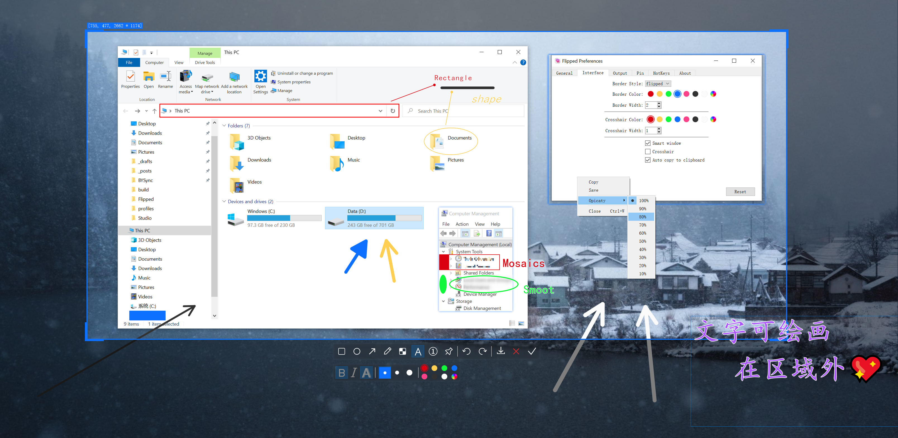

<div align="center">
  <p>
      <h1>
      <a href="https://github.com/XMuli/Flipped">
          
      </a>
      <br/>
      Flipped
    </h1>
    <br/>
    <h4>Simple and beautiful cross-platform screenshot software.</h4>
  </p>
  <p>
    <a href="https://github.com/XMuli/Flipped/actions/workflows/Windows.yml">
      
    </a>
    <a href="https://github.com/XMuli/Flipped/actions/workflows/MacOS.yml">
      
    </a>
    <a href="https://github.com/XMuli/Flipped/actions/workflows/Linux.yml">
      
    </a>
    <a href="https://flameshot.org/docs/installation/development-build/">
      
    </a>
    <a href="https://github.com/XMuli/Flipped/releases">
      
    </a>
    <a href="https://github.com/XMuli/Flipped/releases">
      
    </a>
  <a href="https://github.com/XMuli/Flipped">
      
    </a>
  </p>
  <p align="right"><br><a href="README.md">English</a> | <a href="README.zh_CN.md">简体中文</a></p>
</div>


## Preview



<br>

## Index

- [Features](#features)
- [Keyboard shortcuts](#Keyboard shortcuts)
- [Compilation](#Compilation)
  - [Dependencies](#Dependencies)
  - [Windows](#Windows)
  - [MacOS / Linux](#MacOS / Linux)
- [Prebuilt packages](#Prebuilt packages)
- [License](#License)
- [](#)

<br>

## Features

- Multi-screen screenshot, time-lapse screenshot, custom screenshot
- Pinning the picture
- Intelligent window recognition（Windows & Linux）
- Draw Rectangle, Ellipse, Arrow, Custom Path, Mosaic, Text, Serial Number
- Undo, Redo (multi-level), Save, Cancel, Copy
- Plugin Framework

<br>

## Keyboard shortcuts

| Keys                                                         | Description                      | Mode   |
| ------------------------------------------------------------ | -------------------------------- | ------ |
| <kbd>←</kbd>, <kbd>↓</kbd>, <kbd>↑</kbd>, <kbd>→</kbd> ( <kbd>A</kbd>, <kbd>S</kbd>, <kbd>W</kbd>, <kbd>D</kbd> ) | Move selection 1px               | Local  |
| <kbd>Ctrl</kbd> + <kbd>←</kbd>, <kbd>↓</kbd>, <kbd>↑</kbd>, <kbd>→</kbd> | Extended selection 1 px          | Local  |
| <kbd>Alt</kbd> + <kbd>←</kbd>, <kbd>↓</kbd>, <kbd>↑</kbd>, <kbd>→</kbd> | Shrink selection 1 px            | Local  |
| <kbd>Shift</kbd> + <kbd>←</kbd>, <kbd>↓</kbd>, <kbd>↑</kbd>, <kbd>→</kbd> | Move selection 10 px             | Local  |
| <kbd>Shift</kbd> + <kbd>Ctrl</kbd> + <kbd>←</kbd>, <kbd>↓</kbd>, <kbd>↑</kbd>, <kbd>→</kbd> | Extended selection 10 px         | Local  |
| <kbd>Shift</kbd> + <kbd>Alt</kbd> + <kbd>←</kbd>, <kbd>↓</kbd>, <kbd>↑</kbd>, <kbd>→</kbd> | Shrink selection 10 px           | Local  |
| <kbd>Esc</kbd>                                               | Quit capture                     | Local  |
|                                                              |                                  |        |
| <kbd>Ctrl</kbd> + <kbd>Shift</kbd>  + <kbd>A</kbd>           | Window activation capture screen | Global |
| <kbd>Ctrl</kbd> + <kbd>Shift</kbd>  + <kbd>L</kbd>           | Time-lapse screen capture        | Global |
| <kbd>Ctrl</kbd> + <kbd>Shift</kbd>  + <kbd>S</kbd>           | Full screen capture screen       | Global |

<br>

## Compilation

### Dependencies

- Qt >= 5.15.2
- CMake >= 3.16
- MSVC >= 2019 | MinGW >=  8.1.0 | GCC >= 9.4 | Clang >= 12.0

​	NOTE: This is a successfully compiled dependency version, lower versions have not been tested.

<br>

### Windows

- **Kit Tools:** Windows 10 & Qt 5.15.2 & CMake 3.24.1 & MSVC 2019 ( or MinGW 8.1.0)

- **Compile Step:**

  ```bash
  # ******************** MSVC 2019 ********************
  #『Step1』
  # x86:
  添加 "C:\Qt\5.15.2\msvc2019\bin" 到 path 后，终端执行 echo %PATH% 使其立即生效
  "C:\Program Files (x86)\Microsoft Visual Studio\2019\Professional\VC\Auxiliary\Build\vcvarsall.bat" x86
  cmake -G "Visual Studio 16 2019" -A Win32 ..
  devenv Flipped.sln /Build "Release|Win32"
  
  # x64:
  添加 "C:\Qt\5.15.2\msvc2019_64\bin" 到 path 后，终端执行 echo %PATH% 使其立即生效
  "C:\Program Files (x86)\Microsoft Visual Studio\2019\Professional\VC\Auxiliary\Build\vcvarsall.bat" x64
  cmake -G "Visual Studio 16 2019" -A x64 ..
  devenv Flipped.sln /Build "Release|x64"
  
  #『Step2』
  Visual Studio 2019 open `Flipped.sln`
  
  #『Step3』
  windeployqt  bin/Flipped.exe --no-translations
  
  # ******************** MinGW 8.1.0 ********************
  QtCreator opens the `CMakeLists.txt` file in the root directory of the source code
  ```

- **Notes:**

  - **devenv:** 编译项目实例。
    -  `"C:\Program Files (x86)\Microsoft Visual Studio\2019\Professional\Common7\IDE\devenv.com"`  
  - **vcvarsall.bat:** 初始化 MSVC 交叉编译的环境（x86/x64）
    - `"C:\Program Files (x86)\Microsoft Visual Studio\2019\Professional\VC\Auxiliary\Build\vcvarsall.bat"` 
  - msvc交叉编译:使用vcvarsall.bat设置命令行编译环境（https://blog.csdn.net/10km/article/details/51722353）
    %VS140COMNTOOLS%/VC下就有vcvarsall.bat,用于生成命令行编译环境。
    如果要在命令行生成 32位代码，就执行vcvarsall x86
    如果要在32位系统下生成64位代码，就执行vcvarsall x86_amd64
    如果要在64位系统下生成32位代码，就执行vcvarsall x86或vcvarsall amd64_x86
    到了 VS2015，已经支持arm平台了，所以如果要生成arm平台的代码，就执行vcvarsall x86_arm 如果你的操作系统是64位的也可以 vcvarsall amd64_arm

<br>

### MacOS / Linux

- **Kit Tools:** 

  - **MacOS:** MacOS 10.15 & Qt 5.15.2 & CMake 3.24 & Clang 12.0
  - **Linux:** Ubuntu 20.04 & Qt 5.15.2 & CMake 3.24 & GCC 9.4

- **Compile Step:**

  ```bash
  git clone --recursive https://github.com/XMuli/Flipped.git
  cd Flipped
  mkdir build & cd build
  cmake ..
  make -j16
  ```

<br>

## Prebuilt packages

Some prebuilt packages are provided on [the release page of the GitHub project repository](https://github.com/XMuli/Flipped/releases).

<br>

## License
